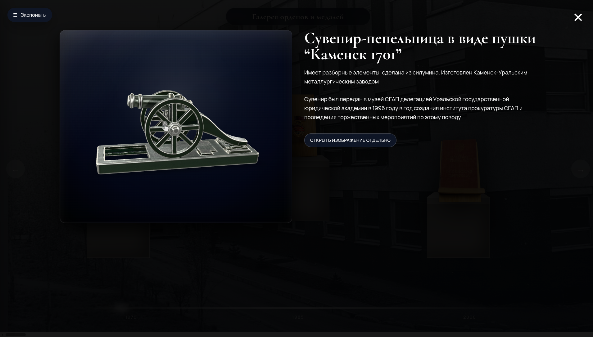

# Виртуальный музей СГЮА — интерактивный 3D-музей на чистом JavaScript

Интерактивная веб-галерея с поддержкой 3D-моделей, создана без использования фреймворков. Проект демонстрирует навыки:
- чистого JavaScript (ES6+)
- работы с 3D (WebGL через `<model-viewer>`)
- управления состоянием приложения
- адаптивного дизайна
- структурирования данных

## 🧰 Используемые технологии

- **HTML5 / CSS3 / JavaScript (ES6+)**
- **Web Components / `<model-viewer>`** — для 3D
- **Responsive Design** — поддержка мобильных устройств
- **Оптимизация изображений** — WebP, lazy loading
- **Чистая архитектура** — разделение данных и логики (Museum Data + App Logic)

## 🎯 Почему это сильный проект

- ✅ **Реализован с нуля** — без фреймворков, с нуля написана логика маршрутизации, управления состоянием, поиска
- ✅ **Масштабируемая структура данных** — легко добавлять новые экспонаты и залы
- ✅ **Интерактивность** — поиск, модальные окна, поддержка 3D
- ✅ **Адаптивность** — работает на всех устройствах
- ✅ **Демонстрация UX-мышления** — плавные переходы, поддержка клавиатуры, доступность

## 🖼️ Примеры интерфейса




## 🌐 Демо
👉 [Посмотреть проект онлайн](https://kulnevk.github.io/Virtual-Museum-SSLA)

## 🚀 Запуск локально

1. Склонируйте репозиторий:
   ```bash
   git clone https://github.com/kulnevk/Virtual-Museum-SSLA.git